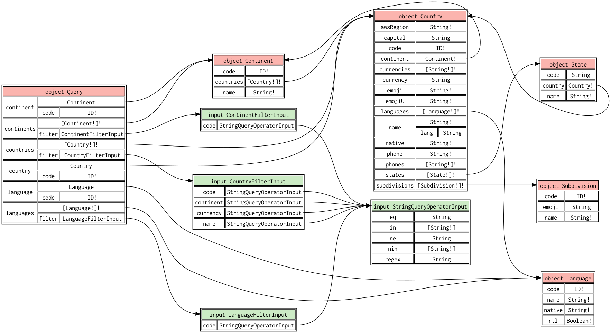
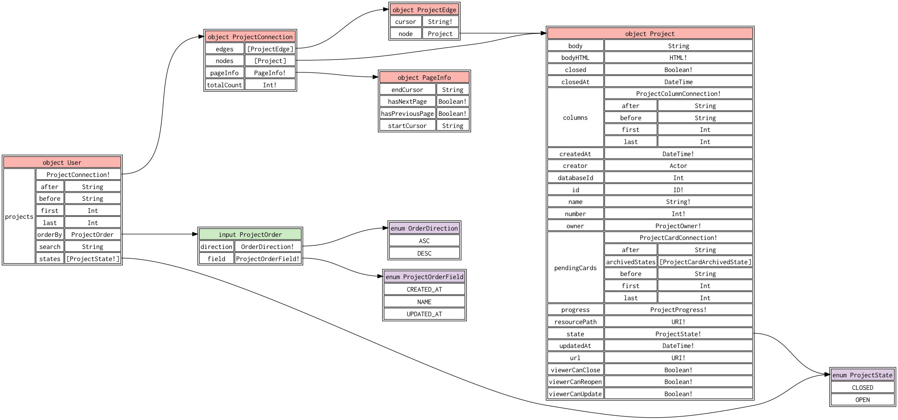

# `gquil`

`gquil` is a tool for introspecting GraphQL schemas on the command line.

It is designed to help make large GraphQL schemas more easily navigable, and is intended to be used in conjunction with other CLI tools you already use. It can output information about large GraphQL schemas in several forms:

- A line-delimited format for lists of fields, types, and directives (suitable for direct inspection, or use with `grep`, `sort`, `awk`, etc.)
- A JSON format (suitable for processing with tools like [`jq`](https://github.com/jqlang/jq))
- GraphViz's [DOT language](https://graphviz.org/doc/info/lang.html) for visualization purposes (suitable for use with `dot`)
- GraphQL SDL (suitable for feeding back into `gquil` itself, or using with other GraphQL-related tools)

gquil aims to follow the [Command Line Interface Guidelines](https://clig.dev/).

## Installation

Pre-built binaries for macOS and Linux are published to [GitHub releases](https://github.com/benweint/gquil/releases).

You can also install via Homebrew, using the formula hosted in this repo:

```
brew tap benweint/gquil https://github.com/benweint/gquil
brew install gquil
```

## Feedback & contributions

See [CONTRIBUTING.md](./CONTRIBUTING.md).

## Capabilities

### Visualizing schemas

You can visualize GraphQL schemas using the `viz` subcommand, by piping the output into the `dot` command from [GraphViz](https://graphviz.org/). For example:

```
❯ gquil viz examples/countries.graphql | dot -Tpdf >out.pdf
```

Produces output like this:



#### Trimming the visualization

Real GraphQL schemas tend to have a lot of types with a lot of fields, which can make the resulting visualization both overwhelming and slow to render. For this reason, it can be useful to trim down the visualization using the `--from` and `--depth` options in order to denote a set of types or fields of interest that you'd like to anchor your visualization at. For example, this command trims the GitHub GraphQL API to only the fields and types reachable from within 2 hops from `User.projects`:

```
❯ gquil viz --from User.projects --depth 3 examples/github.graphql
```

It produces:



### Listing types, fields, and directives

#### Listing types

You can list all types within a GraphQL schema. Note that 'types' in the context of GraphQL is overloaded, and includes object types, enums, interfaces, unions, input objects, and scalars.

```
❯ gquil ls types examples/github.graphql
INPUT_OBJECT	AbortQueuedMigrationsInput
OBJECT	AbortQueuedMigrationsPayload
INPUT_OBJECT	AbortRepositoryMigrationInput
OBJECT	AbortRepositoryMigrationPayload
INPUT_OBJECT	AcceptEnterpriseAdministratorInvitationInput
... snip ...
```

You can filter types by kind, union membership, interface implementation status, and graph reachability from a given root type or field. For example, to find all types in the GitHub GraphQL API which implement `UniformResourceLocatable` and are reachable within 2 hops from the `Release` type:

```
❯ gquil ls types --implements UniformResourceLocatable --from Release --depth 2 examples/github.graphql
OBJECT	Commit
OBJECT	Release
OBJECT	Repository
OBJECT	User
```

Applied directives are not emitted by default, but you can add them to the output with `--include-directives`:

```
❯ gquil ls types --include-directives examples/github.graphql | grep @
INPUT_OBJECT	MarkNotificationAsDoneInput @requiredCapabilities(requiredCapabilities: ["access_internal_graphql_notifications"])
OBJECT	MarkNotificationAsDonePayload @requiredCapabilities(requiredCapabilities: ["access_internal_graphql_notifications"])
INPUT_OBJECT	UnsubscribeFromNotificationsInput @requiredCapabilities(requiredCapabilities: ["access_internal_graphql_notifications"])
OBJECT	UnsubscribeFromNotificationsPayload @requiredCapabilities(requiredCapabilities: ["access_internal_graphql_notifications"])
```

The `--json` flag will emit a JSON representation of the selected types, including their descriptions and field lists.

#### Listing fields

You can also list individual fields. This will include fields on object types, interfaces, and input object types.

```
❯ gquil ls fields --on-type Votable examples/github.graphql 
Votable.upvoteCount: Int!
Votable.viewerCanUpvote: Boolean!
Votable.viewerHasUpvoted: Boolean!
```

### Generating GraphQL SDL from an introspection endpoint

Some GraphQL servers expose an [introspection schema](https://graphql.org/learn/introspection/) for making queries about the type system supported by the server. The types used for this introspection schema are specified [here](https://spec.graphql.org/October2021/#sec-Introspection), but writing queries directly against the introspection schema is neither simple nor pleasant.

`gquil` tries to help by making it easy to generate a materialized GraphSQL SDL document from an introspection endpoint, like this:

```
❯ gquil introspection generate-sdl https://countries.trevorblades.com
type Continent {
	code: ID!
	countries: [Country!]!
	name: String!
}
... snip ...
```

This is particularly useful in combination with other the `gquil` subcommands described above. For example, to list all fields in a GraphQL API, you can combine the `introspection generate-sdl` and `ls fields` subcommands:

```
❯ gquil introspection generate-sdl https://countries.trevorblades.com | gquil ls fields -
Continent.code: ID!
Continent.countries: [Country!]!
Continent.name: String!
Country.awsRegion: String!
... snip ...
```

#### Adding extra headers

Some GraphQL APIs require authentication, usually passed via HTTP headers. You can attach additional headers to the introspection HTTP request via the `--header` flag to `generate-sdl`.

### Merging multiple GraphQL SDL files

Sometimes, GraphQL schemas are split across multiple files. For this reason, most `gquil` subcommands accept any number of `.graphql` SDL files as input. However, sometimes it's useful to be able to merge together multiple GraphQL files in a normalized way. The `merge` subcommand allows you to do this:

```
❯ gquil merge examples/github.graphql examples/tiny.graphql
```

During the merging process, this command will ensure that there are no duplicate definitions, and that the merged result is actually a valid GraphQL SDL document, producing an error if it is not.

The resulting GraphQL will have types and directives sorted by their names, making the output deterministic.

## More examples

These examples show some ways that you can compose `gquil` with other tools.

### Check type / name consistency for a given field name

Are all fields named `user` in the GitHub GraphQL schema typed as `User`? Nope!

```
❯ gquil ls fields --named user --json ./examples/github.graphql | jq '[.[]|.underlyingTypeName]|unique'
[
  "Actor",
  "User"
]
```

### Diff two GraphQL schemas with `dyff`

By using `gquil json` to produce a JSON representation of both the old and new schemas, you can generate a nice-looking diff report between them with [`dyff`](https://github.com/homeport/dyff):

```
❯ dyff between --omit-header \
  <(gquil json before.graphql) \
  <(gquil json after.graphql)

types
  + one list entry added:
    - name: Banana
    │ kind: OBJECT
    │ interfaces:
    │ - Edible
    │ fields:
    │ - name: calories
    │ │ type:
    │ │ │ name: Int
    │ │ │ kind: SCALAR
    │ │ typeName: Int
    │ │ underlyingTypeName: Int

types.Edible.possibleTypeNames
  + one list entry added:
    - Banana
```
